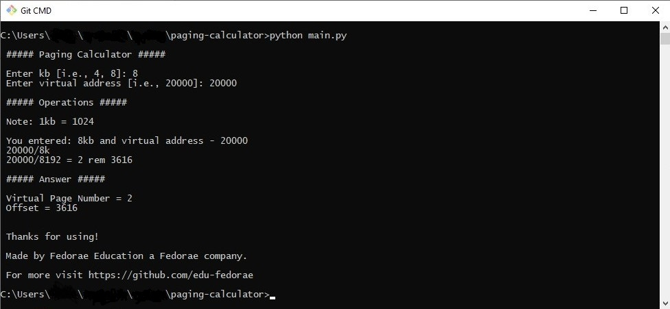

### Simple Paging Calculator

# Run
```
git clone https://github.com/edu-fedorae/paging-calculator.git

cd paging-calculator

python main.py
```
# Screenshot


# Known bugs:
[*] Has no error handling

.........................

Made by [Fedorae Education](https://edu.fedorae.com) a [Fedorae, LTD.](https://fedorae.com) company

For more visit https://github.com/edu-fedorae
